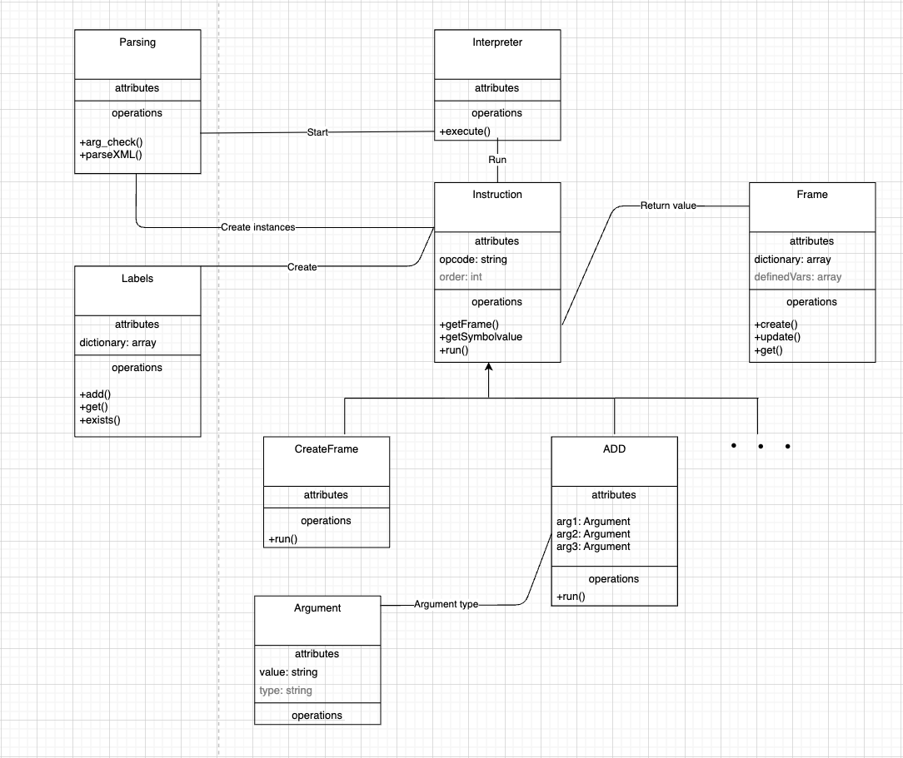

### Interpret implementation documentation

The implementation of the interpreter is divided into several parts:

Each part is implemented in a separate class. The classes are connected by the UML diagram below.

 
